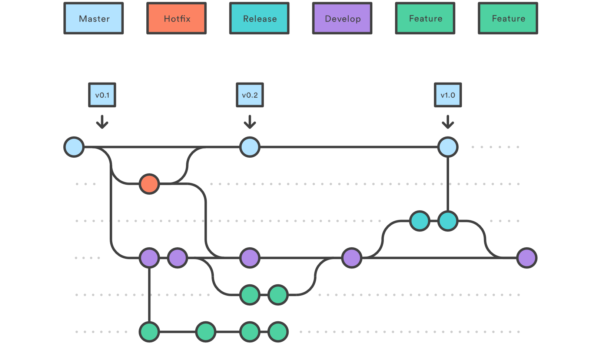

# Coding Rules

The coding rules are based on few already existing rules of SasView and other programs available from SINE2020 project (primarily Mantid <http://www.mantidproject.org/Coding_Standards>). The idea is to implement the coding rules at ESS and then potentially suggest the guideline for future developers.

The following document is divided into subsections

-   Golden Rule
-   Versioning
-   QML Coding Standards
-   Comments
    -   Naming
    -   Imports
    -   Coding Style
-   Python Coding Standards
    -   Docstrings
    -   Comments
    -   Naming
    -   Imports
    -   Exception handling
    -   Coding Style
-   Python Unit testing
-   (QML) GUI testing
-   GIT
-   Code reviews
-   Contributor Guidelines
-   Code Editors (Not sure if we want to include it)

## Golden Rule

-   The committed code should NEVER break the build.
-   If you do break the build - the #1 priority is to fix it IMMEDIATELY.

## Versioning

We should try to adopt an existing, well documented versioning standard, e.g. [Semantic Versioning 2.0](https://semver.org/).

## QML Coding Standards

Should follow rules specified by the "official" QML coding convention <https://doc.qt.io/qt-5/qml-codingconventions.html>

-   Structure object attributes in the well defined order
    -   ID → Properties → Signals → JS functions → Objects → Children → States → Transitions
-   Properties should be specified in a column, unless they are closely related, like x, y, z in which case single line should be used.
-   Try to use group notation when using multiple properties
    ```javascript
    font {
      bold: true;
      italic: true;
      pixelSize: 20;
      capitalization: Font.AllUppercase
    }
    ```
    rather than
    ```javascript
    font.bold: true
    font.italic: true
    font.pixelSize: 20
    font.capitalization: Font.AllUppercase
    ```
-   Omit square brackets for single element lists
-   JavaScript should be inlined or a simple block. Strive to not use JS in the QML layer.
-   Type safety: try to declare properties with actual type rather than blank _var_.
    ```javascript
    property string name
    property MyMenu optionsMenu
    ```
    rather than
    ```javascript
    property var name
    property var optionsMenu
    ```
-   **Action**: create a style file for our QML code and use it with QtCreator and maybe with QmlFmt

### Style

Follow the QtQuick Best Practices recommendations on <https://doc.qt.io/qt-5/qtquick-bestpractices.html>

-   Bundle Application Resources.
-   **Separate UI from logic.**
-   Keep the logic layer (Python) unaware of the View layer (QML).
-   Use anchors to lay out the visual items and avoid layouts.
-   Try not to specify explicit width and height for items.
-   Try to use vector graphics for small icons (SVG) - they scale nicely and don't require several sizes of bitmap images.

## Python Coding Standards

### Docstring

When in doubt, the best is to follow PEP 257 (<https://www.python.org/dev/peps/pep-0257/>). A few rules that are particularly recommended to follow are mentioned below:

-   All modules should normally have docstrings, and all functions and classes exported by a module should also have docstrings.
-   For consistency, always use """triple double quotes""" around docstrings. Use r"""raw triple double quotes""" if you use any backslashes in your docstrings.
-   There are two forms of docstrings: one-liners and multi-line docstrings. One-liners are for really obvious cases. They should really fit on one line.
-   Multi-line docstrings consist of a summary line just like a one-line docstring, followed by a blank line, followed by a more elaborate description.
-   The docstring for a module should generally list the classes, exceptions and functions (and any other objects) that are exported by the module, with a one-line summary of each. (These summaries generally give less detail than the summary line in the object's docstring.) The docstring for a package (i.e., the docstring of the package's \_\_init\_\_.py module) should also list the modules and subpackages exported by the package.
-   The docstring for a function or method should summarize its behavior and document its arguments, return value(s), side effects, exceptions raised, and restrictions on when it can be called (all if applicable). Optional arguments should be indicated. It should be documented whether keyword arguments are part of the interface.
-   The docstring for a class should summarize its behavior and list the public methods and instance variables. If the class is intended to be subclassed, and has an additional interface for subclasses, this interface should be listed separately (in the docstring). The class constructor should be documented in the docstring for its \_\_init\_\_ method. Individual methods should be documented by their own docstring.

### Naming

-   Use `CamelCase` for class names and `camelCase` for method names
-   Use `box_car` with underscores separating words for variable names.
-   Use `box_car` with underscores for namespaces & directories
-   Use `BOX_CAR` with underscores for constants
-   Use `_[Cc]amelCase` with a leading underscore for non-public classes and methods.
-   Never use `__box_car__` with leading and trailing double underscores
-   Avoid one-letter variable names, unless for iterators inside (short) list comprehension statements
-   Methods should have verb or phrase names, eg. `calculateSpectrum`
-   ?QML registered properties should follow lower `camelCase` convention and start with `qt_` prefix, e.g. `qt_braggPeaks`
-   QML registered python properties should be defined in the Properties.qml file for use in the QML layer

### Imports

-   Import only one module per line:
    ```python
    import sascalc
    import sasmodels
    ```
    not
    ```python
    import sasmodels, sascalc
    ```
-   It is recommended to import multiple classes and/or methods from the same module on the same line:
    `from sasmodels import barbell, cylinder`
-   **Avoid importing `*` from any module**. It pollutes the namespace and is typically a waste of time and memory.
-   Imports should be grouped in the following order:
    -   standard library imports
    -   related third party imports
    -   local application/library specific imports
-   Put a blank line between each group of imports.

### Exception Handling

-   Use if and try/except block to test for errors that could happen in normal program operation.
-   Avoid as much as possible general exceptions
    ```python
    try:
        ...
    except:
        ...
    ```
    unless there is a very good reason. If so, add a comment justifying the reasoning and a corresponding pylint exception so this code does not get flagged.
-   If you catch an exception and all you do is calling pass or print, you have not dealt with the error properly.
-   Exceptions should not be used for flow control, unless there is a very good reason for it. Document these reasons.
-   Error codes from a method should never be returned - use exceptions.

### Coding Style

When in doubt - follow [PEP 8](http://www.python.org/dev/peps/pep-0008/) (<https://www.python.org/dev/peps/pep-0008/>)

#### Indentation

-   Use 4 spaces to indent, not tabs.
-   Indent 4 spaces per nested level.

#### Spaces in Expressions & Statements

-   Do not put spaces around parentheses, brackets, or curly braces.
-   Do not put spaces before commas, colons, or semicolons.
-   Put one space around operators.
-   However one can use no spaces with operators of higher priority, _e.g._,
    `y = a*x**2 + b*x + c`

#### Miscellaneous

-   Strive to create short methods/functions doing one and only one thing. This makes the code easier to test and more reusable.
-   **Methods/functions should either DO something (change object's state) or ANSWER something (return information about object). Not both at the same time.**
-   Limit lines to a maximum of 120 characters.
-   Do not put semicolons at the end of lines.
-   Avoid using magic numbers
    Use:
    ```python
    max_bins = 7
    if i < max_bins:
      ...
    ```
    Not:
    ```python
    if i < 7:
      ...
    ```
-   Ideally, the code should conform to the [SOLID](https://en.wikipedia.org/wiki/SOLID) principles.

#### Comments in the code

-   **Comments should explain "Why" not "What".**
-   Comments should usually be complete sentences.
-   Use block comments to talk about the code immediately following the comments.
-   Use inline comments (sparingly) to clarify confusing lines.

## Testing

-   Unit tests should test one method only. This allows you to easily identify what failed if the test fails.
-   Unit tests should not be coupled together, therefore one unit test CANNOT rely on another unit test having completed first.
-   Unit tests should use small and simple data sets.
-   Tests should be fast, ideally really fast - certainly not more than a few seconds (exceptions for cases like fit runs)
-   Untestable code is a code-smell, if you can't get the code under test it probably needs refactoring into smaller pieces.
-   Weight your testing to be destructive rather than demonstrative. Destructive tests are more efficient in finding bugs. (Try to make the code fail!)
-   Use long and descriptive names for testing functions. The reason is testing functions are never called explicitly. `square()` or even `sqr()` is ok in running code, but in testing code you would have names such as `test_square_of_number_2()`,`test_square_negative_number()`. These function names are displayed when a test fails, and should be as descriptive as possible.
-   Attributes of a good test: **Fast, Clear, Isolated, Reliable**

## GIT

-   Using git branches is mandated when developing new features or implementing significant changes. It is also a good habit to regularly merge you branch with master as well as push it Github.
-   Development scenario should consist of:
    -   developing in a feature branch
    -   merging with the _develop_ branch after code review and after making sure unit and GUI tests run correctly. Review/merge with develop should be done using Github pull request feature.
    -   merging the _develop_ branch at the release point, after extensive testing and code freeze in _develop_.
-   Remember to add files using _git add_ before committing your changes.
-   Have a self-explanatory commit message. "Merged with master" is not sufficient. It is a good practice to do a _git log_ before pushing to master and check for the top message. _git commit --amend_ can be used to fix commit message if we are not satisfied with it.
-   Only the person(s) responsible should be tasked with merging develop → master.
-   Remote work branches, draft releases and ci caches should be deleted at final release
    -   Branches: https://github.com/easyDiffraction/easyDiffraction/branches
    -   Releases: https://github.com/easyDiffraction/easyDiffraction/releases
    -   Caches: https://travis-ci.org/easyDiffraction/easyDiffraction/caches
-   When merging a branch with multiple commits use --squash or interactively rebase before pushing to master.

    

## Code Reviews

-   Code reviews by another developer are **encouraged** for minor functionality and **required** for major changes.
-   Code reviews should be preferably performed directly in the code as annotations using GitHub pull request/review mechanism.
-   Code review isn't just to find bugs someone else made. It's also the time to learn the incremental changes in a large code base and **ask questions**. It's your chance to understand another component or area and expand your expertise as well. The more you understand other components the better so take the time to learn and ask questions while the developer is available.
-   Follow the standard practices:
    -   Review no more than 400 lines of code at a time
    -   Take your time. Inspection rates should be under 500 LOC per hour
    -   Don't review code for more than 90 minutes at a time
    -   Use checklists - they substantially improve results for both authors and reviewers (It's very likely that each person on your team makes the same 10 mistakes over and over. Omissions in particular are the hardest defects to find because it's difficult to review something that isn't there. Checklists are the most effective way to eliminate frequently made errors and to combat the challenges of omission finding)
    -   Remember to review related unit tests - they are as important as the code.
    -   **Verify** that the defects are actually fixed

## Editors

Tips and tricks of how to make your life easier when developing code with your favorite editor.

Example editors used in the group are:

-   vi
-   PyCharm
-   Visual Studio with PTVS
-   Visual Studio Clode

Both PyCharm and VS allow source level debugging both of self-spawned processes and by attaching to an already running process.

## Contributor Guidelines

GitHub allows for specifying contributor guidelines in a streamlined way: <https://help.github.com/en/github/building-a-strong-community/setting-guidelines-for-repository-contributors>

Existing guidelines are a good, ehm... guildeline for creating our own version.

We can start with the default template <https://gist.github.com/PurpleBooth/b24679402957c63ec426> and retrofit it to our needs.

Example: [CONTRIBUTING.md](/../../CONTRIBUTING.md)

## API

The proposed access to the core functionality should be consistent for all perspectives and straightforward to use.

-   All known input arguments should be set in \_\_init\_\_, during instantiation, with proper checks
-   Additional input data can be set directly through the @property decorator
    -   _Getters_:
        ```python
        @property
        def intensity(self):
          return self.wave.intensity
        ```
    -   _Setters_:
        ```python
        @intensity.setter
        def intensity(self, value):
          self.wave.set_intensity(intensity)
        ```
-   All user accessible input/output data should be available through getters
-   \_\_getattr\_\_ and \_\_setattr\_\_ should be avoided.
-   Main functionality should be exposed as a method with easy to understand name, e.g. calculate() and should return the results object/structure
-   When defining the interface, type hints are an important part of the definition. Type hints are described in PEP-484 [https://www.python.org/dev/peps/pep-0484](https://www.python.org/dev/peps/pep-0484/) and should be added for all API methods.
    ```python
    def fit(self, msg_q=None, q=None, handler=None, curr_thread=None, ftol=1.49012e-8, reset_flag=False):
      # type: (CalcThread.queue, CalcThread.queue, FitHandler, CalcThread, float, bool) -> Union[CalcThread.queue, FResult]
    ```
-   In cases where several pieces of information are calculated at the same time, a list of outputs, a dictionary, or an output object that contains the computed data should be returned
-   Error codes from a method should never be returned - use exceptions

## GUI

There's plenty of sources for GUI guidelines on which we can base our own.

Most stress the obvious requirements that a well functioning GUI should implement:

-   clarity
-   putting user in control
-   reduce user's memory load
-   one primary action per screen
-   consistency
-   always have a feedback available to the user, whenever they do something

examples of decent guideline descriptions:

-   <http://bokardo.com/principles-of-user-interface-design/>
-   <http://theomandel.com/wp-content/uploads/2012/07/Mandel-GoldenRules.pdf>
-   <https://guidelines.usability.gov/>

Creating universal GUI guidelines is difficult, since each operating system has its own recommended guidelines

-   [MacOS](https://developer.apple.com/library/content/documentation/UserExperience/Conceptual/OSXHIGuidelines/index.html#//apple_ref/doc/uid/20000961-BABCAJID)
-   [Windows](https://developer.microsoft.com/en-us/windows/desktop/design)
-   [Qt](http://doc.qt.io/qt-4.8/best-practices.html)

We will concentrate on the most important aspects here and will keep developing the document as the project goes. The three main sections are:

-   Design
-   Implementation
-   Testing

### Design

All UI elements should be designed and typed using QML.

Majority of user accessible controls should be available using the keyboard as well

Unexpected behaviour of keyboard shortcuts should be avoided

#### Button placement:

Preferably, action buttons (OK, Cancel, Help) should be placed in the right bottom part of the window.

The placement order should be

**Reset **–** OK – Cancel – Apply – Help**

"Apply" is to be used only by modal dialogs, if the design requires "apply" functionality.

"Reset"

#### Help elements

**Help buttons** should be placed on all dialogs, unless the dialog is extremely straightforward, and simple.

All GUI elements should contain a **tooltip**, describing the purpose of the element succinctly and clearly.

### Implementation

GUI implementation in QML should contain ONLY the **view** layer.

NO LOGIC.

All logic should be delegated to either **model** or **presenter** layers, both using Python.

Exception: very minor JS snippets for when using a callback to Python would be an overkill. This should be properly documented and reviewed.

### Testing

Unit testing of the presenter class should include GUI testing in form of:

1.  Widget types
2.  Non-default widget properties (colors, fonts, initial content)
3.  Names of windows, tabs
4.  User interaction with any interactive component

To encapsulate out of scope calls, we should use MagicMock() from the mock library

|                                  | :smile: | :rage:              | Comments                                        |
| -------------------------------- | ------- | ------------------- | ----------------------------------------------- |
| Help button                      | "Help"  | "HELP", 'help', '?' | the button should be placed at the bottom right |
| Notation of "Angstrom" in labels | Å       | Ang                 |                                                 |
| Superscript instead of '1/...'   | Å-2     | 1/Å2                |                                                 |
